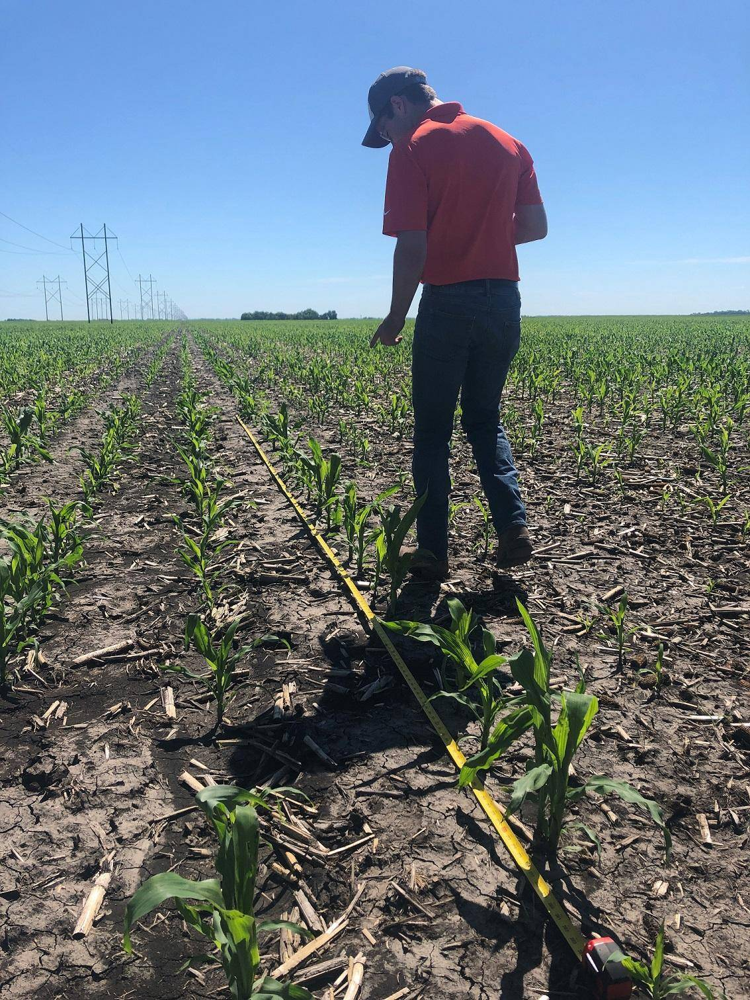

% NDVeye: how to count corn plants on a field using Astropy
% Bator Koncz & Pal Szabo
% QGIS UC 2024 Bratislava
---
width: 1000
height: 500
---

# About us

## Bator Koncz

Education in agriculture

Works as a plant doctor

## Pal Szabo

Education in astronomy

Works as a data engineer

## Not a Glint Solar project

# Corn experiments

## Traditional workflow

##

##

## Workflow using a drone:

. . .

1. Fly a drone

. . .

2. Produce NDVI raster

. . . 

3. Count

. . .

##

##

##

##

## Let's automate counting!

. . . 

Copy astronomy workflow:

. . .

1. Obtain imagery

. . .

2. Background subtraction

. . . 

3. Image segmentation

. . . 

4. Source deblending

. . . 

##

:::notes
https://en.wikipedia.org/wiki/Transiting_Exoplanet_Survey_Satellite#/media/File:TESS_Mission_(41512968122).jpg
:::

##

:::notes
https://en.wikipedia.org/wiki/Transiting_Exoplanet_Survey_Satellite#/media/File:TESS-FirstLight20180807-Released20180917.jpg
:::

# Implementation

# Usage

## 

##

##

# Future

## Alternatives

